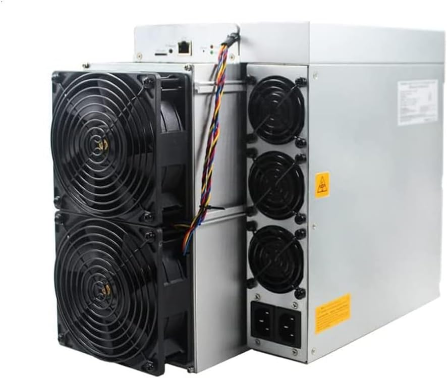
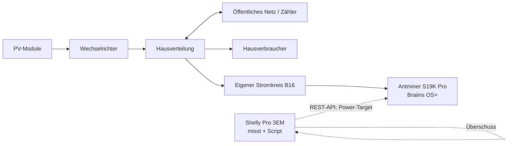

# PV-Bitcoin-Miner



Überschuss-Strom einer PV-Anlage statt der Einspeisung ins Netz zum **Bitcoin-Mining** nutzen – der Miner regelt seine Leistung automatisch nach dem gerade verfügbaren PV-Überschuss. Gesteuert wird alles **direkt vom Shelly Pro 3EM** über ein Script; kein zusätzlicher Rechner nötig.

> ⚠️ **Haftungsausschluss.** Dieses Projekt dient nur zu Informationszwecken. Es ist **keine** Finanz-, Steuer- oder Elektroberatung. Der elektrische Anschluss muss von einer Elektrofachkraft ausgeführt werden. Mining-Erträge sind volatil und in Deutschland steuerlich relevant. Nutzung auf eigene Verantwortung.

---

## Funktionsprinzip

Der Shelly Pro 3EM hängt am **Netzzähler** und misst den Saldo aus Hausverbrauch und PV-Erzeugung. Ein negativer Wert (`total_act_power < 0`) bedeutet Einspeisung, also Überschuss. Das Script auf dem Shelly berechnet daraus die verfügbare Leistung und setzt am Miner per **Braiins-OS+-REST-API** ein passendes Power-Target – oder pausiert ihn, wenn zu wenig Überschuss da ist.



Vollständiger Schalt- und Signalplan: [`schaltplan.svg`](schaltplan.svg)

---

## Stückliste

| Komponente | Empfehlung | Hinweis |
|---|---|---|
| Energiemessung | **Shelly Pro 3EM** | am Netzzähler, 3-phasig |
| Miner | **Antminer S19K Pro** (gebraucht) | ~120 TH/s, ~2.760 W Stock |
| Firmware | **Braiins OS+** | Power-Target & REST-API |
| Stromkreis | LS-Schalter B16, Leitung 3×2,5 mm² | durch Elektrofachkraft |
| Netzwerk | LAN-Kabel Shelly ↔ Router ↔ Miner | stabile Verbindung |
| Aufstellung | belüfteter, schallentkoppelter Raum | ~2 kW Abwärme, sehr laut |

---

## Miner-Übersicht & Vergleich

Für PV-Überschuss zählt vor allem die **Effizienz** (J/TH): Je weniger Watt pro Terahash, desto mehr Hashrate – und damit Bitcoin – pro Kilowattstunde Überschuss.

| Modell | Hashrate | Stock-Leistung | Effizienz | Regelbereich (Braiins OS+) | Gebraucht* | Lautstärke |
|---|---|---|---|---|---|---|
| Antminer S9 | ~13,5 TH/s | ~1.350 W | ~100 J/TH | ~250–1.400 W | ~80–130 € | sehr laut |
| Antminer S17e | ~50–64 TH/s | ~2.500 W | ~45 J/TH | ~1.000–2.500 W | ~150–300 € | sehr laut |
| Antminer S19 Pro | ~110 TH/s | ~3.250 W | ~30–34 J/TH | ~1.500–3.250 W | ~400–800 € | sehr laut |
| Antminer S19j Pro | ~100 TH/s | ~3.050 W | ~30 J/TH | ~1.500–3.000 W | ~400–700 € | sehr laut |
| **Antminer S19K Pro** | **~120 TH/s** | **~2.760 W** | **~23 J/TH** | **~900–2.760 W** | **~600–900 €** | sehr laut |

\*Grobe Richtwerte aus Kleinanzeigen/eBay-DE, stark schwankend.

### Hashrate bei begrenztem 2.000-W-Überschuss (gedrosselt)

| Modell @ ~2.000 W | ungefähre Hashrate | rel. Ertrag |
|---|---|---|
| S9 (max. ~1.350 W) | ~13–14 TH/s | 1× |
| S17e | ~40–45 TH/s | ~3× |
| S19(j) Pro | ~60–70 TH/s | ~5× |
| S19K Pro | ~80–85 TH/s | ~6× |

---

## Warum der S19K Pro

- **Beste Effizienz** der Auswahl (~23 J/TH) → holt aus 2.000 W am meisten heraus.
- **Sauber regelbar** über Braiins OS+: Power-Target **stufenlos 900–2.760 W**. Der Autotuner stellt Spannung/Takt automatisch auf das vorgegebene Watt-Ziel ein.
- REST-API erlaubt die Steuerung **direkt vom Shelly** ohne Zusatzrechner.

**Wichtige Einschränkung:** Der S19K Pro geht **nicht unter ~900 W**. Fällt der Überschuss darunter (Wolken, früher Morgen/Abend), muss der Miner **ganz pausieren**, statt sparsam weiterzulaufen. Bei stark schwankendem Wetter nutzt ein S9 (Untergrenze ~250 W) mehr Stunden; bei stabilem, hohem Mittagsüberschuss spielt der S19K Pro seine Effizienz aus. Deshalb arbeitet das Script mit einer **Hysterese** (EIN ab 1.050 W, AUS unter 850 W).

---

## Wirtschaftlichkeit & Amortisation

**Annahmen** (Stand Mitte Juni 2026 – bitte selbst aktualisieren):

- Hashprice ≈ **$0,031 / TH/s / Tag** (≈ €0,029, Kurs 1,08)
- BTC ≈ $64.000
- Jährlicher PV-Überschuss ≈ **3.000 kWh** ← **größte Stellschraube, an eigene Anlage anpassen**
- Stromkosten = 0 € (sonst ungenutzter Überschuss)

### Ertrag pro kWh Überschuss

| Miner | Effizienz | Ertrag/kWh |
|---|---|---|
| S9 | ~100 J/TH | ~€0,012 |
| S17e | ~45 J/TH | ~€0,027 |
| S19 Pro | ~32 J/TH | ~€0,037 |
| S19j Pro | ~30 J/TH | ~€0,040 |
| S19K Pro | ~23 J/TH | ~€0,052 |

### Kosten, Jahresertrag, Amortisation

| Miner | Hardware | nutzbare kWh/Jahr | Ertrag/Jahr | Amortisation |
|---|---|---|---|---|
| S9 | ~100 € | ~2.400 | ~29 € | ~3,4 Jahre |
| S17e | ~220 € | ~3.000 | ~80 € | ~2,7 Jahre |
| S19 Pro | ~600 € | ~3.000 | ~112 € | ~5,4 Jahre |
| S19j Pro | ~550 € | ~3.000 | ~120 € | ~4,6 Jahre |
| S19K Pro | ~750 € | ~3.000 | ~156 € | ~4,8 Jahre |

### Realitäts-Check (ehrlich)

1. **Einspeisevergütung schlägt Mining oft.** Bei ~7–8 ct/kWh Vergütung ist Einspeisen finanziell besser als jeder Miner-Ertrag/kWh (1,2–5,2 ct). Mining lohnt rein finanziell nur, wenn die Alternative „verschenken/abregeln" ist – oder man bewusst BTC ansparen will (Kurschance).
2. **Difficulty steigt.** Der Ertrag pro TH/s sinkt historisch über die Zeit → reale Amortisation tendenziell länger.
3. **Verschleiß.** Gebrauchte Hardware kann ausfallen, bevor sie sich amortisiert (v. a. alter S9).
4. **Eigenverbrauch schlägt alles.** Überschuss für Warmwasser/Batterie spart ~30 ct/kWh – deutlich wertvoller als Mining.

---

## Einrichtung

### 1. Braiins OS+ auf dem Miner
- Firmware installieren (siehe [braiins.com/os](https://braiins.com/os)).
- **Public REST-API** sicherstellen (Port 80, `/api/v1`). API-Doku: [developer.braiins-os.com](https://developer.braiins-os.com/latest/openapi.html).
- Benutzer/Passwort des Miners notieren (lokal, **nicht** ins Repo).

### 2. Shelly Pro 3EM
- Vorzeichen prüfen: bei sicherer Einspeisung muss `EM.GetStatus` ein **negatives** `total_act_power` zeigen.
  Aufruf im Browser: `http://<shelly-ip>/rpc/EM.GetStatus?id=0`

### 3. Script einspielen
- Shelly Web-UI → **Scripts** → **Add Script** → Inhalt aus [`shelly/pv-miner-control.js`](shelly/pv-miner-control.js) einfügen.
- Im `CONFIG`-Block `minerIp`, `minerUser`, `minerPass` **lokal** eintragen.
- Speichern, **Start**, Logs beobachten.

### Konfigurierbare Parameter (Auszug)

| Parameter | Default | Bedeutung |
|---|---|---|
| `powerLevels` | `900…1900` | nutzbare Leistungsstufen (W) |
| `puffer` | `100` | Sicherheitsabstand zur Netzeinspeisung (W) |
| `onThreshold` | `1050` | Überschuss zum Einschalten (W) |
| `offThreshold` | `850` | Überschuss zum Ausschalten (W) |
| `intervalSec` | `30` | Prüfintervall (s) |

---

## Sicherheit & Datenschutz

- **Keine privaten Daten committen:** IP-Adressen und Zugangsdaten nur lokal eintragen. Siehe [`.gitignore`](.gitignore).
- **Elektrik:** Eigener Stromkreis, korrekte Absicherung (LS B16), Leitungsquerschnitt und FI/RCD durch eine **Elektrofachkraft**.
- **Wärme/Lärm:** ~2 kW Abwärme, ~75 dB+ – nur in geeignetem Raum betreiben.
- Der Shelly Pro 3EM ist ein **Messgerät** und schaltet keine Last direkt; die Steuerung läuft über die Miner-API.

---

## Projektstruktur

```
pv-bitcoin-miner/
├── README.md                  Diese Startseite
├── LICENSE                    MIT-Lizenz
├── .gitignore                 hält lokale Konfig/Zugangsdaten aus Git
├── shelly/
│   └── pv-miner-control.js     Steuer-Script für den Shelly Pro 3EM
└── images/
    └── schaltplan.svg          Schalt- und Signalplan
```

---

## Lizenz

MIT – siehe [`LICENSE`](LICENSE). Quellen für API/Spezifikationen: Braiins (OS+ REST-API), Shelly (Gen2 Scripting/EM-Komponente). Zahlen sind Momentaufnahmen und ohne Gewähr.
